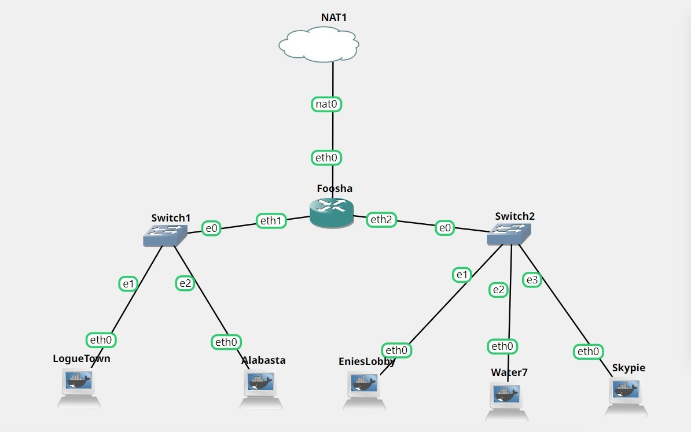
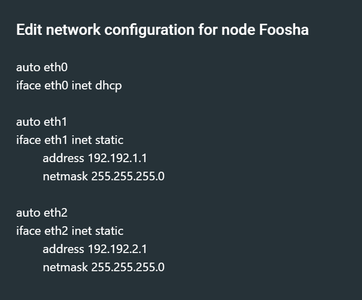
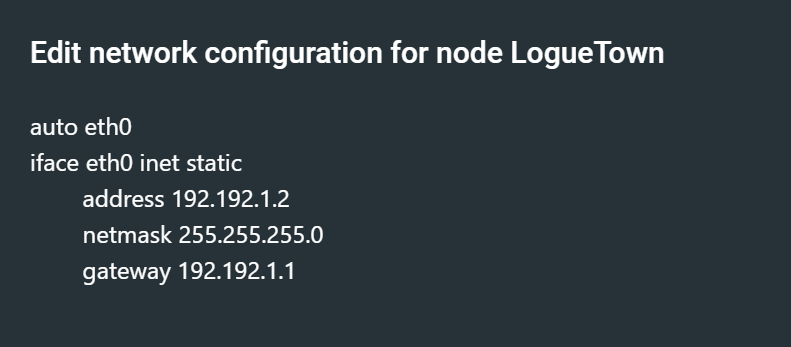
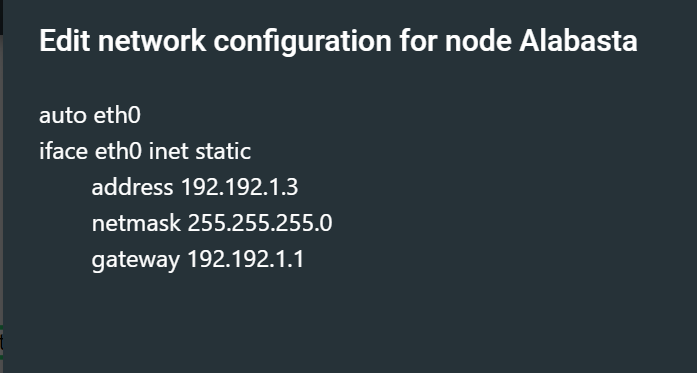
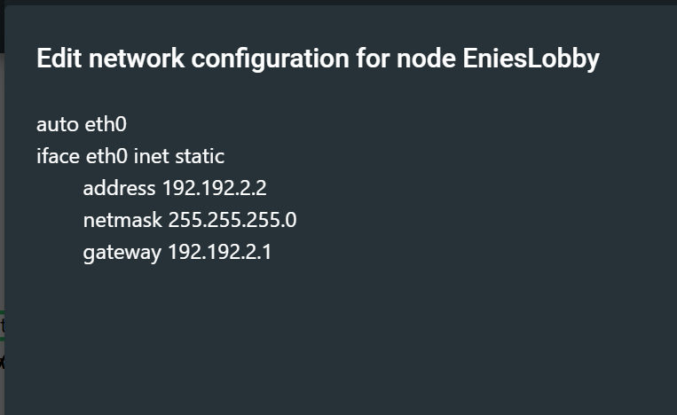
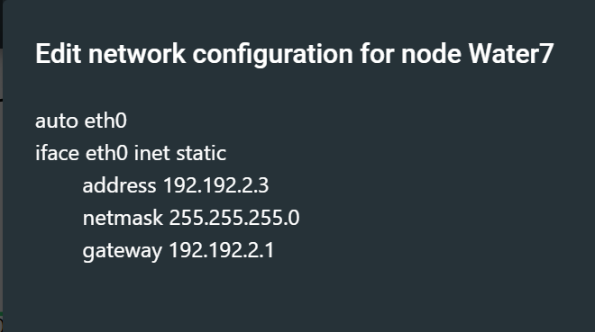
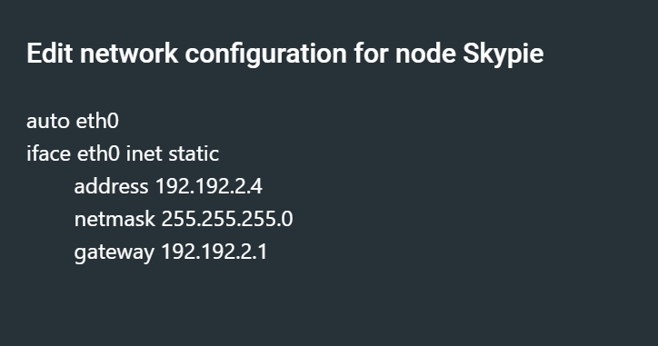

# Jarkom-Modul-2-D01-2021
## Soal 1
EniesLobby akan dijadikan sebagai DNS Master, Water7 akan dijadikan DNS Slave, dan Skypie akan digunakan sebagai Web Server. Terdapat 2 Client yaitu Loguetown, dan Alabasta. Semua node terhubung pada router Foosha, sehingga dapat mengakses internet.<br><br>
### Jawaban
Untuk Topologi yang sudah kami buat sebagai berikut.


Selanjutnya, lakukan konfigurasi setiap node yang akan dijalankan.<br>
* Foosha


* Loguetown


* Alabasta


* Ennieslobby


* Water7


* Skypie


Kemudian, semua node diaktifkan dan juga jalankan
```
iptables -t nat -A 
POSTROUTING -o eth0 -j 
MASQUERADE -s 
192.192.0.0/16
```
di Foosa supaya bisa terkoneksi ke internet. Dan jangan lupa jalankan command
```
echo nameserver 
192.168.122.1 > /etc/
resolv.conf
``` 
di semua node.

## Soal 2


## Soal 3


## Soal 4


## Soal 5


## Soal 6
Setelah itu terdapat subdomain mecha.franky.yyy.com dengan alias www.mecha.franky.yyy.com yang didelegasikan dari EniesLobby ke Water7 dengan IP menuju ke Skypie dalam folder sunnygo

### Jawaban
#### Pada EniesLobby
Pada EnisLobby kami melakukan konfigurasi pada `/etc/bind/kaizoku/franky.d01.com` sebagai berikut

``
; BIND data file for local loopback interface
;
$TTL    604800
@       IN      SOA     franky.d01.com. root.franky.d01.com. (
                              2         ; Serial
                         604800         ; Refresh
                          86400         ; Retry
                        2419200         ; Expire
                         604800 )       ; Negative Cache TTL
;
@       IN      NS      franky.d01.com.
@       IN      A       192.192.2.2
www     IN      CNAME   franky.d01.com.
super   IN      A       192.192.2.4     ; subdomain ke arah IP Skypie
www.super IN    CNAME   super.franky.d01.com.
ns1     IN      A       192.192.2.3     ; IP Water7
mecha   IN      NS      ns1             ; delegasi subdomain ke Water7
``
Pada EniesLobby kami hanya menambahkan konfigurasi tersebut, dan tidak merubah konfigurasi pada zone. Selain itu kami juga menambahkan konfigurasi pada `/etc/bind/named.conf.options`

``
options {
        directory "/var/cache/bind";

        // If there is a firewall between you and nameservers you want
        // to talk to, you may need to fix the firewall to allow multiple
        // ports to talk.  See http://www.kb.cert.org/vuls/id/800113

        // If your ISP provided one or more IP addresses for stable
        // nameservers, you probably want to use them as forwarders.
        // Uncomment the following block, and insert the addresses replacing
        // the all-0s placeholder.

        // forwarders {
        //      0.0.0.0;
        // };

        //========================================================================
        // If BIND logs error messages about the root key being expired,
        // you will need to update your keys.  See https://www.isc.org/bind-keys
        //========================================================================
        // dnssec-validation auto;
        allow-query{any;};

        auth-nxdomain no;    # conform to RFC1035
        listen-on-v6 { any; };
 ``
 
 #### Pada Water 7
 Pada water 7 pertama sekali menambahkan zone pada file `/etc/bind/named.conf.local` sehingga file tersebut terlihat sebagai berikut
 
 ``
 zone "franky.d01.com" {
        type master;
        notify yes;
        also-notify { 192.192.2.3; }; // IP Water7 DNS Slave
        allow-transfer { 192.192.2.3; }; // IP Water7 DNS Slave dan untuk delegasi subdomain
        file "/etc/bind/kaizoku/franky.d01.com";
};
``


## Soal 7
Untuk memperlancar komunikasi Luffy dan rekannya, dibuatkan subdomain melalui Water7 dengan nama general.mecha.franky.yyy.com dengan alias www.general.mecha.franky.yyy.com yang mengarah ke Skypie
### Jawaban

## Soal 8
Setelah melakukan konfigurasi server, maka dilakukan konfigurasi Webserver. Pertama dengan webserver www.franky.yyy.com. Pertama, luffy membutuhkan webserver dengan DocumentRoot pada `/var/www/franky.yyy.com.`
### Jawaban

## Soal 9
Setelah itu, Luffy juga membutuhkan agar url `www.franky.yyy.com/index.php/home` dapat menjadi menjadi `www.franky.yyy.com/home.`
### Jawaban


## Soal 10
Setelah itu, pada subdomain www.super.franky.yyy.com, Luffy membutuhkan penyimpanan aset yang memiliki DocumentRoot pada `/var/www/super.franky.yyy.com.`
### Jawaban

## Soal 11
Akan tetapi, pada folder `/public`, Luffy ingin hanya dapat melakukan directory listing saja.
### Jawaban


## Soal 12
Tidak hanya itu, Luffy juga menyiapkan error file 404.html pada folder `/error` untuk mengganti error kode pada apache
### Jawaban


## Soal 13
Luffy juga meminta Nami untuk dibuatkan konfigurasi virtual host. Virtual host ini bertujuan untuk dapat mengakses file asset www.super.franky.yyy.com/public/js menjadi www.super.franky.yyy.com/js
### Jawaban

